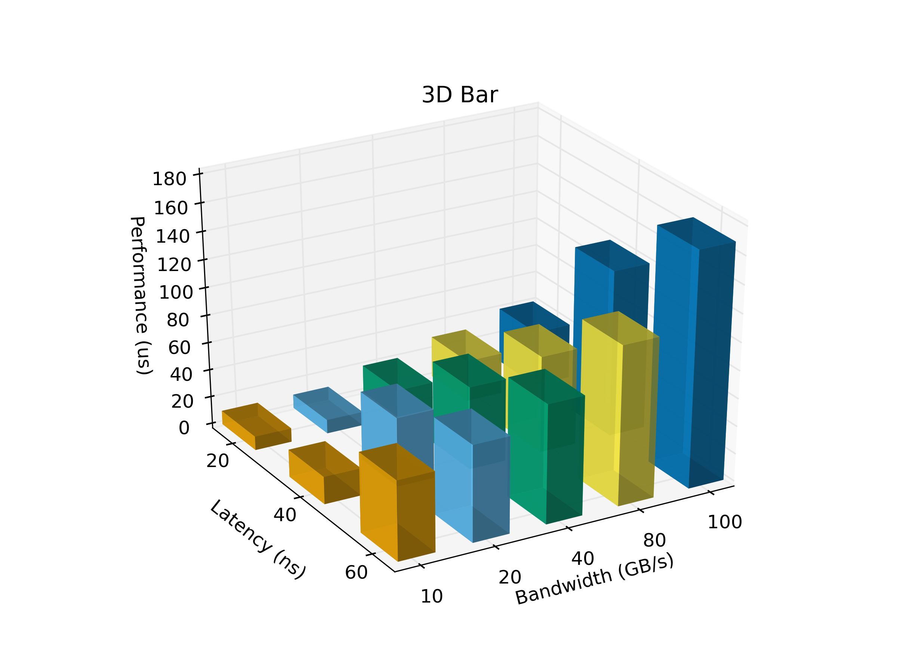

# Polly
Polly is built on top of Matplotlib that can easily generate plots charts and graphs. It could be used by academic writing and data visualization. 

## User Guide


### Plot a 2D bar graph

To plot a 2D bar graph from a csv file, simply do
```
python bar_2d.py --csv examples/2d_bar.csv
```

or you if you have your *axes* object and params ready in your program, you can use
```
bar_2d.plot(ax, params)
```

The result is as follows:


### Plot a 2D Stacked bar graph

To plot a 2D bar graph from a csv file, simply do
```
python 2d_stacked_bar.py --csv examples/2d_stacked_sample.csv
```

or you if you have your *axes* object and params ready in your program, you can use
```
2d_stacked_bar.plot(ax, params)
```

The result is as follows:


### Plot a 3D Bar Graph

To plot a 3D bar graph from a csv file, simply do
```
python 3dbar.py --csv examples/3d_bar.csv
```

or you if you have your *axes* object and params ready in your program, you can use
```
2dbar.plot(ax, params)
```

The result is as follows: (2 graphs of different angles will be generated so that you have the best view.


### Plot a 3D Surface Graph

To plot a 3D surface graph from a csv file, simply do
```
python 3dbar.py --csv examples/3d_surface_sample.csv
```

or you if you have your *axes* object and params ready in your program, you can use
```
2dbar.plot(ax, params)
```

The result looks like: 


### Others

For more options for above commands, simply use *-h* or *--help* option when running the commands.

**TODO**: 

- complete a param list with default values.
- put output format in args
- figure out what should be put in args, what should be in params
    - For now I think graph-type-specific parameters should be kept in params, e.g. the data 
    - Other general stuff should be in args, e.g. the output format, location, etc.
- need support for 3d surface, heatmap, etc

